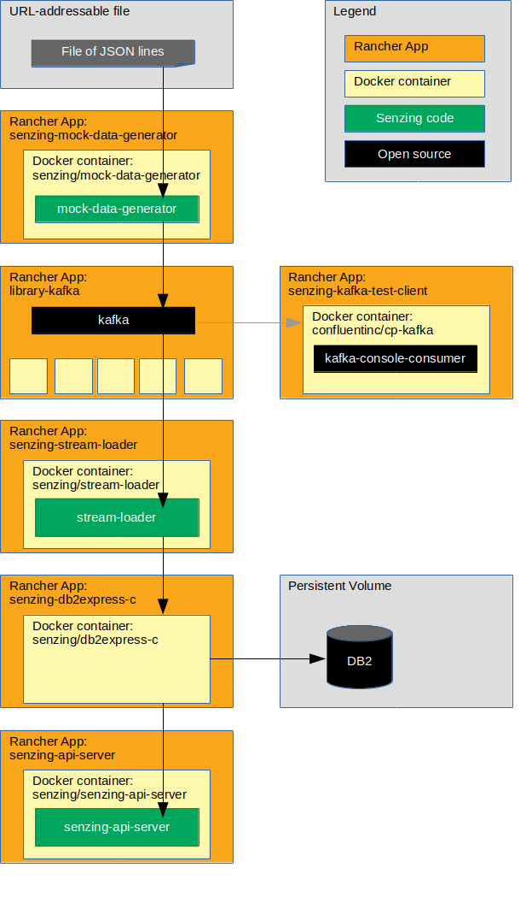

# rancher-db2-demo

## Overview

The following diagram shows the relationship of the Rancher apps, docker containers, and code in this Rancher demonstration.



### Contents

1. [Expectations](#expectations)
    1. [Space](#space)
    1. [Time](#time)
    1. [Background knowledge](#background-knowledge)
1. [Demonstrate](#demonstrate)
    1. [Clone repository](#clone-repository)
    1. [Prerequisites](#prerequisites)
    1. [Set environment variables](#set-environment-variables)
    1. [Create custom answer files](#create-custom-answer-files)
    1. [Create custom kubernetes configuration files](#create-custom-kubernetes-configuration-files)
    1. [Set default context](#set-default-context)
    1. [Add catalogs](#add-catalogs)
    1. [Create project](#create-project)
    1. [Switch context](#switch-context)
    1. [Create namespace](#create-namespace)
    1. [Add registries](#add-registries)
    1. [Create persistent volume](#create-persistent-volume)
    1. [Install Kafka](#install-kafka)
    1. [Install Kafka test client](#install-kafka-test-client)
    1. [Install DB2](#install-db2)
    1. [Initialize database](#initialize-database)
    1. [Install mock-data-generator](#install-mock-data-generator)
    1. [Install stream-loader](#install-stream-loader)
    1. [Install senzing-api-server](#install-senzing-api-server)
    1. [Test Senzing REST API server](#test-senzing-rest-api-server)
1. [Cleanup](#cleanup)
    1. [Switch context for delete](#switch-context-for-delete)
    1. [Delete everything in project](#delete-everything-in-project)
    1. [Default context after cleanup](#default-context-after-cleanup)
    1. [Delete catalogs](#delete-catalogs)

## Expectations

### Space

This repository and demonstration require 20 GB free disk space.

### Time

Budget 4 hours to get the demonstration up-and-running, depending on CPU and network speeds.

### Background knowledge

This repository assumes a working knowledge of:

1. [Docker](https://github.com/Senzing/knowledge-base/blob/master/WHATIS/docker.md)
1. [Kubernetes](https://github.com/Senzing/knowledge-base/blob/master/WHATIS/kubernetes.md)
1. [Helm](https://github.com/Senzing/knowledge-base/blob/master/WHATIS/helm.md)
1. [Rancher](https://github.com/Senzing/knowledge-base/blob/master/WHATIS/rancher.md)

## Demonstrate

### Clone repository

1. Using these environment variable values:

    ```console
    export GIT_ACCOUNT=senzing
    export GIT_REPOSITORY=rancher-demo
    ```

   Then follow steps in [clone-repository](https://github.com/Senzing/knowledge-base/blob/master/HOWTO/clone-repository.md).

1. After the repository has been cloned, be sure the following are set:

    ```console
    export GIT_ACCOUNT_DIR=~/${GIT_ACCOUNT}.git
    export GIT_REPOSITORY_DIR="${GIT_ACCOUNT_DIR}/${GIT_REPOSITORY}"
    ```

### Prerequisites

#### IBM docker images

1. Authorize [hub.docker.com/_/db2-developer-c-edition](https://hub.docker.com/_/db2-developer-c-edition)
   1. Visit [hub.docker.com/_/db2-developer-c-edition](https://hub.docker.com/_/db2-developer-c-edition)
   1. Click "Proceed to Checkout" button.
   1. Agree to terms and click "Get Content" button.

#### Rancher

1. [Install Rancher](https://github.com/Senzing/knowledge-base/blob/master/HOWTO/install-rancher.md).

1. Simple example for local development:

    ```console
    sudo docker run \
      --volume /opt/rancher:/var/lib/rancher \
      --publish 80:80 \
      --publish 443:443 \
       rancher/rancher:latest
    ```

#### Rancher cluster

1. [Create the cluster](https://rancher.com/docs/rancher/v2.x/en/quick-start-guide/deployment/quickstart-manual-setup/#4-create-the-cluster)
1. Set environment variable with Rancher cluster name. Example:

    ```console
    export RANCHER_CLUSTER_NAME=my-rancher-cluster
    ```

#### Senzing docker images

1. Build [senzing/senzing-base](https://github.com/Senzing/docker-senzing-base) docker image.

1. Make Senzing docker images.

    ```console
    sudo docker build --tag senzing/db2                 https://github.com/senzing/docker-db2.git
    sudo docker build --tag senzing/db2express-c        https://github.com/senzing/docker-db2express-c.git
    sudo docker build --tag senzing/stream-loader       https://github.com/senzing/stream-loader.git
    sudo docker build --tag senzing/mock-data-generator https://github.com/senzing/mock-data-generator.git
    ```

1. Build [senzing/senzing-api-server](https://github.com/Senzing/senzing-api-server#using-docker) docker image.

#### Docker registry

1. If you need to create a private docker registry, see
       [HOWTO - Install docker registry server](https://github.com/Senzing/knowledge-base/blob/master/HOWTO/install-docker-registry-server.md).
1. Set environment variable. Example:

    ```console
    export DOCKER_REGISTRY_URL=my.docker-registry.com:5000
    ```

1. Add Senzing docker images to private docker registry.

    ```console
    for GIT_REPOSITORY in \
      "db2" \
      "db2express-c" \
      "mock-data-generator" \
      "senzing-api-server" \
      "stream-loader"; \
    do \
      sudo docker tag senzing/${GIT_REPOSITORY} ${DOCKER_REGISTRY_URL}/senzing/${GIT_REPOSITORY}; \
      sudo docker push ${DOCKER_REGISTRY_URL}/senzing/${GIT_REPOSITORY}; \
      sudo docker rmi  ${DOCKER_REGISTRY_URL}/senzing/${GIT_REPOSITORY}; \
    done
    ```

### Set environment variables

1. Environment variables that need customization.  Example:

    ```console
    export RANCHER_CLUSTER_NAME=my-rancher-cluster
    export RANCHER_PREFIX=my
    ```

1. Set environment variables listed in "[Clone repository](#clone-repository)".
1. Environment variables used in `rancher` CLI commands.

    ```console
    export RANCHER_PROJECT_NAME=${RANCHER_PREFIX}-project
    export RANCHER_NAMESPACE_NAME=${RANCHER_PREFIX}-namespace
    ```

### Create custom answer files

1. Variation #1. Quick method using `envsubst`.

    ```console
    export RANCHER_ANSWERS_DIR=${GIT_REPOSITORY_DIR}/rancher-answers
    mkdir -p ${RANCHER_ANSWERS_DIR}

    for file in ${GIT_REPOSITORY_DIR}/rancher-answers-templates/*.yaml; \
    do \
      envsubst < "${file}" > "${RANCHER_ANSWERS_DIR}/$(basename ${file})";
    done
    ```

1. Variation #2. Manually copy example files and modify. Example:

    ```console
    export RANCHER_ANSWERS_DIR=${GIT_REPOSITORY_DIR}/rancher-answers
    mkdir -p ${RANCHER_ANSWERS_DIR}
    cp ${GIT_REPOSITORY_DIR}/rancher-answers-templates/*.yaml ${RANCHER_ANSWERS_DIR}
    ```

    1. Modify ${RANCHER_ANSWERS_DIR}/mock-data-generator.yaml
        1. **image.repository**
            1. Example: `image.repository: "my.docker-registry.com:5000/senzing/mock-data-generator"`
        1. **senzing.kafkaBootstrapServerHost**
            1. Example: `senzing.kafkaBootstrapServerHost: "my-senzing-db2-kafka-kafka"`
    1. Modify ${RANCHER_ANSWERS_DIR}/ibm-db2oltp-dev.yaml
        1. **global.image.secretName**
            1. Example: `global.image.secretName: "my-docker-io"`
    1. Modify ${RANCHER_ANSWERS_DIR}/senzing-api-server.yaml
        1. **image.repository**
            1. Example: `image.repository: "my.docker-registry.com:5000/senzing/senzing-api-server"`
    1. Modify ${RANCHER_ANSWERS_DIR}/stream-loader-db2.yaml
        1. **image.repository**
            1. Example: `image.repository: "my.docker-registry.com:5000/senzing/stream-loader"`
        1. **senzing.databaseUrl**
            1. Example: `senzing.databaseUrl: "db2://db2inst1:db2inst1@$my-ibm-db2oltp-dev-db2:50000/G2"`
        1. **senzing.kafkaBootstrapServerHost**
            1. Example: `senzing.kafkaBootstrapServerHost: "my-senzing-db2-kafka-kafka"`

1. Modify configuration.

    1. Modify ${RANCHER_ANSWERS_DIR}/db2.yaml
        1. For configuration information, see [helm/db2](https://github.com/helm/charts/tree/master/stable/db2#configuration)

### Create custom kubernetes configuration files

1. Variation #1. Quick method using `envsubst`.

    ```console
    export KUBERNETES_DIR=${GIT_REPOSITORY_DIR}/kubernetes
    mkdir -p ${KUBERNETES_DIR}

    for file in ${GIT_REPOSITORY_DIR}/kubernetes-templates/*; \
    do \
      envsubst < "${file}" > "${KUBERNETES_DIR}/$(basename ${file})";
    done
    ```

1. Variation #2. Manually copy example files and modify. Example:

    ```console
    export KUBERNETES_DIR=${GIT_REPOSITORY_DIR}/kubernetes-2
    mkdir -p ${KUBERNETES_DIR}
    cp ${GIT_REPOSITORY_DIR}/kubernetes-templates/*.yaml ${KUBERNETES_DIR}
    ```

    1. Modify ${KUBERNETES_DIR}/persistent-volume-claim-opt-senzing.yaml
        1. **namespace**
            1. Example: `namespace: my-senzing-db2-namespace`
    1. Modify ${KUBERNETES_DIR}/persistent-volume-claim-db2.yaml
        1. **namespace**
            1. Example: `namespace: my-senzing-db2-namespace`

### Set default context

1. Switch context.  Example:

    ```console
    rancher context switch \
      Default
    ```

### Add catalogs

1. Add Senzing catalog.  Example:

    ```console
    rancher catalog add \
      senzing \
      https://github.com/senzing/charts
    ```

1. Add IBM catalog.  Example:

    ```console
    rancher catalog add \
      ibm \
      https://github.com/IBM/charts
    ```

### Create project

1. Example:

    ```console
    rancher projects create \
      --cluster ${RANCHER_CLUSTER_NAME} \
      --description "Project for ${RANCHER_PROJECT_NAME}" \
      ${RANCHER_PROJECT_NAME}
    ```

### Switch context

1. Example:

    ```console
    rancher context switch \
      ${RANCHER_PROJECT_NAME}
    ```

### Create namespace

1. Example:

    ```console
    rancher namespace create \
      --description "Namespace for ${RANCHER_PROJECT_NAME}" \
      ${RANCHER_NAMESPACE_NAME}
    ```

### Add registries

Because IBM docker images required acceptance of terms in
[IBM docker images](#ibm-docker-images) step,
Rancher/Kubernetes needs username/password to hub.docker.com
to retrieve the images.

1. Add docker.io registry.
   :warning: hub.docker.com username and password used in previous
   [IBM docker images](#ibm-docker-images)
   step need to be supplied.
   Example:

    ```console
    export DOCKER_USERNAME=me@example.com
    export DOCKER_PASSWORD=fake-password

    rancher kubectl create secret docker-registry ${RANCHER_PREFIX}-docker-io \
      --namespace ${RANCHER_NAMESPACE_NAME} \
      --docker-server=docker.io \
      --docker-username=${DOCKER_USERNAME} \
      --docker-password=${DOCKER_PASSWORD}
    ```

### Create persistent volume

1. If you do not already have an `/opt/senzing` directory on your system, visit
   [HOWTO - Create SENZING_DIR](https://github.com/Senzing/knowledge-base/blob/master/HOWTO/create-senzing-dir.md).

1. Create persistent volumes. Example:

    ```console
    rancher kubectl create \
      -f ${KUBERNETES_DIR}/persistent-volume-db2-data-stor.yaml

    rancher kubectl create \
      -f ${KUBERNETES_DIR}/persistent-volume-opt-senzing.yaml
    ```

1. Create persistent volume claims. Example:

    ```console
    rancher kubectl create \
      -f ${KUBERNETES_DIR}/persistent-volume-claim-db2-data-stor.yaml

    rancher kubectl create \
      -f ${KUBERNETES_DIR}/persistent-volume-claim-opt-senzing.yaml
    ```

### Install Kafka

1. Example:

    ```console
    rancher app install \
      --answers ${RANCHER_ANSWERS_DIR}/kafka.yaml \
      --namespace ${RANCHER_NAMESPACE_NAME} \
      library-kafka \
      ${RANCHER_PREFIX}-kafka
    ```

### Install Kafka test client

1. Install Kafka test client app. Example:

    ```console
    rancher app install \
      --answers ${RANCHER_ANSWERS_DIR}/kafka-test-client.yaml \
      --namespace ${RANCHER_NAMESPACE_NAME} \
      senzing-kafka-test-client \
      ${RANCHER_PREFIX}-kafka-test-client
    ```

1. Run the test client. Run in a separate terminal window. Example:

    ```console
    export RANCHER_PREFIX=my
    export RANCHER_NAMESPACE_NAME=${RANCHER_PREFIX}-namespace

    rancher kubectl exec \
      -it \
      -n ${RANCHER_NAMESPACE_NAME} \
      ${RANCHER_PREFIX}-kafka-test-client -- /usr/bin/kafka-console-consumer \
        --bootstrap-server ${RANCHER_PREFIX}-kafka-kafka:9092 \
        --topic senzing-kafka-topic \
        --from-beginning
    ```

### Install DB2

1. Example:

    ```console
    rancher app install \
      --answers ${RANCHER_ANSWERS_DIR}/ibm-db2oltp-dev.yaml \
      --namespace ${RANCHER_NAMESPACE_NAME} \
      ibm-ibm-db2oltp-dev \
      ${RANCHER_PREFIX}-ibm-db2oltp-dev
    ```

### Initialize database

1. Bring up a DB2 client. Example:

    ```console
    rancher app install \
      --answers ${RANCHER_ANSWERS_DIR}/db2-client.yaml \
      --namespace ${RANCHER_NAMESPACE_NAME} \
      senzing-db2-client \
      ${RANCHER_PREFIX}-db2-client
    ```

1. Catalog "remote" database.
   :warning: Look at the results of the
   "[Initialize database](#initialize-database)"
   step for the correct value of `DB2_HOST`.
   In the DB2 client docker container, run

    ```console
    su - db2inst1

    export RANCHER_PREFIX=my
    export DB2_HOST=${RANCHER_PREFIX}-ibm-db2-ibm-db2oltp-dev-db2

    db2 catalog tcpip node G2_node remote ${DB2_HOST} server 50000
    db2 catalog database G2 at node G2_node
    db2 terminate
    ```

1. Populate database. In docker container, run

    ```console
    db2 connect to g2 user db2inst1 using db2inst1
    db2 -tf /opt/senzing/g2/data/g2core-schema-db2-create.sql
    ```

1. Exit docker container.

    ```console
    db2 connect reset
    exit
    exit
    ```

### Install mock-data-generator

1. Example:

    ```console
    rancher app install \
      --answers ${RANCHER_ANSWERS_DIR}/mock-data-generator.yaml \
      --namespace ${RANCHER_NAMESPACE_NAME} \
      senzing-senzing-mock-data-generator \
      ${RANCHER_PREFIX}-senzing-mock-data-generator
    ```

### Install stream-loader

1. Example:

    ```console
    rancher app install \
      --answers ${RANCHER_ANSWERS_DIR}/stream-loader-db2.yaml \
      --namespace ${RANCHER_NAMESPACE_NAME} \
      senzing-senzing-stream-loader \
      ${RANCHER_PREFIX}-senzing-stream-loader
    ```

### Install senzing-api-server

1. Example:

    ```console
    rancher app install \
      --answers ${RANCHER_ANSWERS_DIR}/senzing-api-server.yaml \
      --namespace ${RANCHER_NAMESPACE_NAME} \
      senzing-senzing-api-server \
      ${RANCHER_PREFIX}-senzing-api-server
    ```

1. Port forward to local machine.  Run in a separate terminal window. Example:

    ```console
    export RANCHER_PREFIX=my
    export RANCHER_NAMESPACE_NAME=${RANCHER_PREFIX}-namespace

    rancher kubectl port-forward --namespace ${RANCHER_NAMESPACE_NAME} svc/${RANCHER_PREFIX}-senzing-api-server 8889:80
    ```

### Test Senzing REST API server

*Note:* port 8889 on the localhost has been mapped to port 8080 in the docker container.
See `rancher kubectl port-forward ...` above.

1. Example:

    ```console
    export SENZING_API_SERVICE=http://localhost:8889

    curl -X GET ${SENZING_API_SERVICE}/heartbeat
    curl -X GET ${SENZING_API_SERVICE}/license
    curl -X GET ${SENZING_API_SERVICE}/entities/1
    ```

## Cleanup

### Switch context for delete

1. Example:

    ```console
    rancher context switch \
      ${RANCHER_PROJECT_NAME}
    ```

### Delete everything in project

1. Example:

    ```console
    rancher app delete ${RANCHER_PREFIX}-senzing-api-server
    rancher app delete ${RANCHER_PREFIX}-senzing-stream-loader
    rancher app delete ${RANCHER_PREFIX}-senzing-mock-data-generator
    rancher app delete ${RANCHER_PREFIX}-db2-client
    rancher app delete ${RANCHER_PREFIX}-ibm-db2oltp-dev
    rancher app delete ${RANCHER_PREFIX}-kafka-test-client
    rancher app delete ${RANCHER_PREFIX}-kafka
    rancher kubectl delete -f ${GIT_REPOSITORY_DIR}/kubernetes/persistent-volume-claim-opt-senzing.yaml
    rancher kubectl delete -f ${GIT_REPOSITORY_DIR}/kubernetes/persistent-volume-claim-db2-data-stor.yaml
    rancher kubectl delete -f ${GIT_REPOSITORY_DIR}/kubernetes/persistent-volume-opt-senzing.yaml
    rancher kubectl delete -f ${GIT_REPOSITORY_DIR}/kubernetes/persistent-volume-db2-data-stor.yaml
    rancher kubectl delete secret docker-registry ${RANCHER_PREFIX}-docker-io
    rancher namespace delete ${RANCHER_NAMESPACE_NAME}
    rancher projects delete ${RANCHER_PROJECT_NAME}
    ```  

### Default context after cleanup

1. Switch context.  Example:

    ```console
    rancher context switch Default
    ```

### Delete catalogs

1. Delete Senzing catalog. Example:

    ```console
    rancher catalog delete ibm
    rancher catalog delete senzing
    ```
