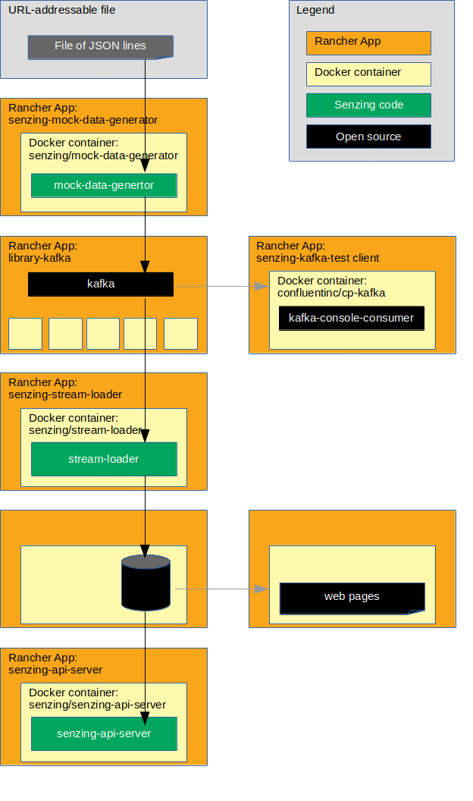

# rancher-postgresql-demo

## Overview

The following diagram shows the relationship of the Rancher apps, docker containers, and code in this Rancher demonstration.



### Contents

1. [Demonstrate](#demonstrate)
    1. [Set environment variables for repository](#set-environment-variables-for-repository)
    1. [Clone repository](#clone-repository)
    1. [Prerequisites](#prerequisites)
    1. [Set environment variables](#set-environment-variables)
    1. [Create custom answer files](#create-custom-answer-files)
    1. [Set default context](#set-default-context)
    1. [Add catalogs](#add-catalogs)
    1. [Create project](#create-project)
    1. [Switch context](#switch-context)
    1. [Create namespace](#create-namespace)
    1. [Create persistent volume](#create-persistent-volume)
    1. [Install Kafka](#install-kafka)
    1. [Install Kafka test client](#install-kafka-test-client)
    1. [Install mySQL](#install-mysql)
    1. [Install phpMyAdmin](#install-phpmyadmin)
    1. [Test access to senzing docker images](#test-access-to-senzing-docker-images)
    1. [Install mock-data-generator](#install-mock-data-generator)
    1. [Install stream-loader](#install-stream-loader)
    1. [Install senzing-api-server](#install-senzing-api-server)
    1. [Test Senzing REST API server](#test-senzing-rest-api-server)
1. [Cleanup](#cleanup)
    1. [Switch context for delete](#switch-context-for-delete)
    1. [Delete everything in project](#delete-everything-in-project)
    1. [Default context after cleanup](#default-context-after-cleanup)
    1. [Delete catalog](#delete-catalog)

## Demonstrate

### Clone repository

1. Using these environment variable values:

    ```console
    export GIT_ACCOUNT=senzing
    export GIT_REPOSITORY=rancher-demo
    ```

   Then follow steps in [clone-repository](https://github.com/Senzing/knowledge-base/blob/master/HOWTO/clone-repository.md).

1. After the repository has been cloned, be sure the following are set:

    ```console
    export GIT_ACCOUNT_DIR=~/${GIT_ACCOUNT}.git
    export GIT_REPOSITORY_DIR="${GIT_ACCOUNT_DIR}/${GIT_REPOSITORY}"
    ```

### Prerequisites

#### Rancher

1. [Install Rancher](https://github.com/Senzing/knowledge-base/blob/master/HOWTO/install-rancher.md).

1. Simple example for local development:

    ```console
    sudo docker run \
      --volume /opt/rancher:/var/lib/rancher \
      --publish 80:80 \
      --publish 443:443 \
       rancher/rancher:latest
    ```

#### Rancher cluster

1. [Create the cluster](https://rancher.com/docs/rancher/v2.x/en/quick-start-guide/deployment/quickstart-manual-setup/#4-create-the-cluster)
1. Set environment variable with Rancher cluster name. Example:

    ```console
    export RANCHER_CLUSTER_NAME=my-rancher-cluster
    ```

#### Senzing docker images

1. Make Senzing docker images.

    ```console
    sudo docker build --tag senzing/hello-world https://github.com/senzing/docker-hello-world.git
    sudo docker build --tag senzing/mock-data-generator https://github.com/senzing/mock-data-generator.git
    sudo docker build --tag senzing/python-base https://github.com/senzing/docker-python-base.git
    sudo docker build --tag senzing/stream-loader https://github.com/senzing/stream-loader.git
    ```

1. Build [senzing/senzing-api-server](https://github.com/Senzing/senzing-api-server#using-docker) docker image.

#### Docker registry

1. If you need to create a private docker registry, see
       [HOWTO - Install docker registry server](https://github.com/Senzing/knowledge-base/blob/master/HOWTO/install-docker-registry-server.md).
1. Set environment variable. Example:

    ```console
    export DOCKER_REGISTRY_URL=my.docker-registry.com:5000
    ```

1. Add Senzing docker images to private docker registry.

    ```console
    for GIT_REPOSITORY in \
      "hello-world" \
      "mock-data-generator" \
      "senzing-api-server" \
      "stream-loader"; \
    do \
      sudo docker tag senzing/${GIT_REPOSITORY} ${DOCKER_REGISTRY_URL}/senzing/${GIT_REPOSITORY}; \
      sudo docker push ${DOCKER_REGISTRY_URL}/senzing/${GIT_REPOSITORY}; \
      sudo docker rmi  ${DOCKER_REGISTRY_URL}/senzing/${GIT_REPOSITORY}; \
    done
    ```

### Set environment variables

1. Environment variables that need customization.  Example:

    ```console
    export RANCHER_CLUSTER_NAME=my-rancher-cluster
    export RANCHER_PREFIX=my-senzing-postgresql
    ```

1. Set environment variables listed in "[Clone repository](#clone-repository)".
1. Environment variables used in `rancher` CLI commands.

    ```console
    export RANCHER_PROJECT_NAME=${RANCHER_PREFIX}-project
    export RANCHER_NAMESPACE_NAME=${RANCHER_PREFIX}-namespace
    ```

### Create custom answer files

1. Variation #1. Quick method using `envsubst`.

    ```console
    export RANCHER_ANSWERS_DIR=${GIT_REPOSITORY_DIR}/rancher-answers
    mkdir -p ${RANCHER_ANSWERS_DIR}

    for file in ${GIT_REPOSITORY_DIR}/rancher-answer-examples/*.yaml; \
    do \
      envsubst < "${file}" > "${RANCHER_ANSWERS_DIR}/$(basename ${file})";
    done
    ```

1. Variation #2. Manually copy example files and modify. Example:

    ```console
    export RANCHER_ANSWERS_DIR=${GIT_REPOSITORY_DIR}/rancher-answers
    mkdir -p ${RANCHER_ANSWERS_DIR}
    cp ${GIT_REPOSITORY_DIR}/rancher-answer-examples/*.yaml ${RANCHER_ANSWERS_DIR}
    ````

    1. Modify ${RANCHER_ANSWERS_DIR}/hello-world.yaml
        1. **image.repository**
            1. Example: `'image.repository': "my.docker-registry.com:5000/senzing/hello-world"`  
    1. Modify ${RANCHER_ANSWERS_DIR}/mock-data-generator.yaml
        1. **image.repository**
            1. Example: `'image.repository': "my.docker-registry.com:5000/senzing/mock-data-generator"`
    1. Modify ${RANCHER_ANSWERS_DIR}/senzing-api-server.yaml
        1. **image.repository**
            1. Example: `'image.repository': "my.docker-registry.com:5000/senzing/senzing-api-server"`
    1. Modify ${RANCHER_ANSWERS_DIR}/stream-loader.yaml
        1. **image.repository**
            1. Example: `'image.repository': "my.docker-registry.com:5000/senzing/stream-loader"`

1. Modify configuration.

    1. Modify ${RANCHER_ANSWERS_DIR}/mock-data-generator.yaml
        1. **senzing.kafkaBootstrapServerHost**
            1. Use hostname of your Kafka server.

    1. Modify ${RANCHER_ANSWERS_DIR}/postgresql.yaml
        1. For configuration information, see [helm/postgresql](https://github.com/helm/charts/tree/master/stable/postgresql#configuration)

    1. Modify ${RANCHER_ANSWERS_DIR}/stream-loader.yaml
        1. **senzing.databaseUrl**
            1. Template:  "mysql://g2:g2@${MYSQL_HOSTNAME}:3306/G2"
            1. Example: `mysql://g2:g2@my.sql-server.com:3306/G2`
        1. **senzing.kafkaBootstrapServerHost**
            1. Use hostname of your Kafka server.

### Set default context

1. Switch context.  Example:

    ```console
    rancher context switch \
      Default
    ```

### Add catalogs

1. Add helm catalog.  Example:

    ```console
    rancher catalog add \
      helm \
      https://github.com/helm/charts
    ```

1. Add Senzing catalog.  Example:

    ```console
    rancher catalog add \
      senzing \
      https://github.com/senzing/charts
    ```

1. Add jjcollinge catalog. Example:

    ```console
    rancher catalog add \
      jjcollinge \
      https://github.com/jjcollinge/phppgadmin-chart
    ```

### Create project

1. Example:

    ```console
    rancher projects create \
      --cluster ${RANCHER_CLUSTER_NAME} \
      --description "Project for ${RANCHER_PROJECT_NAME}" \
      ${RANCHER_PROJECT_NAME}
    ```

### Switch context

1. Example:

    ```console
    rancher context switch \
      ${RANCHER_PROJECT_NAME}
    ```

### Create namespace

1. Example:

    ```console
    rancher namespace create \
      --description "Namespace for ${RANCHER_PROJECT_NAME}" \
      ${RANCHER_NAMESPACE_NAME}
    ```

### Create persistent volume

1. If you do not already have an `/opt/senzing` directory on your system, visit
   [HOWTO - Create SENZING_DIR](https://github.com/Senzing/knowledge-base/blob/master/HOWTO/create-senzing-dir.md).

1. Variation #1. Quick method using `envsubst`.

    ```console
    export KUBERNETES_DIR=${GIT_REPOSITORY_DIR}/kubernetes
    mkdir -p ${KUBERNETES_DIR}

    for file in ${GIT_REPOSITORY_DIR}/kubernetes-examples/*.yaml; \
    do \
      envsubst < "${file}" > "${KUBERNETES_DIR}/$(basename ${file})";
    done
    ```

1. Variation #2. Manually copy example files and modify. Example:

    ```console
    export KUBERNETES_DIR=${GIT_REPOSITORY_DIR}/kubernetes-2
    mkdir -p ${KUBERNETES_DIR}
    cp ${GIT_REPOSITORY_DIR}/kubernetes-examples/*.yaml ${KUBERNETES_DIR}
    ````

    1. Modify ${KUBERNETES_DIR}/persistent-volume-claim-postgresql.yaml
        1. **namespace**
            1. Example: `namespace: mytest-namespace-1`

1. Create "persistent volume" for `/opt/senzing` directory. Example:

    ```console
    rancher kubectl create \
      -f ${KUBERNETES_DIR}/persistent-volume-postgresql.yaml
    ```

1. Create "persistent volume claim" for `/opt/senzing` directory. Example:

    ```console
    rancher kubectl create \
      -f ${KUBERNETES_DIR}/persistent-volume-claim-postgresql.yaml
    ```

### Install Kafka

1. Example:

    ```console
    rancher app install \
      --answers ${RANCHER_ANSWERS_DIR}/kafka.yaml \
      --namespace ${RANCHER_NAMESPACE_NAME} \
      library-kafka \
      ${RANCHER_PREFIX}-kafka
    ```

### Install Kafka test client

1. Install Kafka test client app. Example:

    ```console
    rancher app install \
      --answers ${RANCHER_ANSWERS_DIR}/kafka-test-client.yaml \
      --namespace ${RANCHER_NAMESPACE_NAME} \
      senzing-kafka-test-client \
      ${RANCHER_PREFIX}-kafka-test-client
    ```

1. Run the test client. Run in a separate terminal window. Example:

    ```console
    export RANCHER_PREFIX=my-senzing-postgresql
    export RANCHER_NAMESPACE_NAME=${RANCHER_PREFIX}-namespace

    rancher kubectl exec \
      -it \
      -n ${RANCHER_NAMESPACE_NAME} \
      ${RANCHER_PREFIX}-kafka-test-client -- /usr/bin/kafka-console-consumer \
        --bootstrap-server ${RANCHER_PREFIX}-kafka-kafka:9092 \
        --topic senzing-kafka-topic \
        --from-beginning
    ```

### Install Postgresql

1. Example:

    ```console
    rancher app install \
      --answers ${RANCHER_ANSWERS_DIR}/postgresql.yaml \
      --namespace ${RANCHER_NAMESPACE_NAME} \
      postgresql \
      ${RANCHER_PREFIX}-postgresql
    ```

### Install phpPgAdmin

1. Install phpPgAdmin app. Example:

    ```console
    rancher app install \
      --answers ${RANCHER_ANSWERS_DIR}/phppgadmin.yaml \
      --namespace ${RANCHER_NAMESPACE_NAME} \
      phppgadmin-chart \
      ${RANCHER_PREFIX}-phppgadmin
    ```

1. Port forward to local machine.  Run in a separate terminal window. Example:

    ```console
    export RANCHER_PREFIX=my-senzing-postgresql
    export RANCHER_NAMESPACE_NAME=${RANCHER_PREFIX}-namespace

    rancher kubectl port-forward --namespace ${RANCHER_NAMESPACE_NAME} svc/${RANCHER_PREFIX}-phppgadmin-phppgadmin-chart 8081:8080
    ````

1. Open browser to [localhost:8081](http://localhost:8081)
    1. Login
       1. mysqlUser/mysqlPassword in `rancher-answers/mysql.yaml`
       1. Default: username: g2  password: g2
    1. On left-hand navigation, select "G2" database.
    1. Select "Import" tab.
    1. Click "Browse..." button.
        1. Choose `/opt/senzing/g2/data/g2core-schema-mysql-create.sql`.
    1. Click "Go" button.

### Test access to senzing docker images

1. Get Docker image from public `hub.docker.com` Docker registry. Example:

    ```console
    rancher app install \
      --answers ${RANCHER_ANSWERS_DIR}/hello-world-on-hub-docker-com.yaml \
      --namespace ${RANCHER_NAMESPACE_NAME} \
      senzing-hello-world-on-hub-docker-com \
      ${RANCHER_PREFIX}-senzing-hello-world-on-hub-docker-com
    ```

1. Get Docker image from private Docker registry. Example:

    ```console
    rancher app install \
      --answers ${RANCHER_ANSWERS_DIR}/hello-world.yaml \
      --namespace ${RANCHER_NAMESPACE_NAME} \
      senzing-hello-world \
      ${RANCHER_PREFIX}-senzing-hello-world
    ```

1. If both applications work, then Senzing docker images have been properly registered in your private
   docker registry and Rancher can retrieve the images.
   1. If applications do not work, revisit
      "[Senzing docker images](#senzing-docker-images)" and
      "[Docker registry](#docker-registry)".
1. Delete the test apps.

    ```console
    rancher app delete ${RANCHER_PREFIX}-senzing-hello-world-on-hub-docker-com
    rancher app delete ${RANCHER_PREFIX}-senzing-hello-world
    ```

### Install mock-data-generator

1. Example:

    ```console
    rancher app install \
      --answers ${RANCHER_ANSWERS_DIR}/mock-data-generator.yaml \
      --namespace ${RANCHER_NAMESPACE_NAME} \
      senzing-mock-data-generator \
      ${RANCHER_PREFIX}-senzing-mock-data-generator
    ```

### Install stream-loader

1. Example:

    ```console
    rancher app install \
      --answers ${RANCHER_ANSWERS_DIR}/stream-loader.yaml \
      --namespace ${RANCHER_NAMESPACE_NAME} \
      senzing-stream-loader \
      ${RANCHER_PREFIX}-senzing-stream-loader
    ```

### Install senzing-api-server

1. Example:

    ```console
    rancher app install \
      --answers ${RANCHER_ANSWERS_DIR}/senzing-api-server.yaml \
      --namespace ${RANCHER_NAMESPACE_NAME} \
      senzing-api-server \
      ${RANCHER_PREFIX}-senzing-api-server
    ```

1. Port forward to local machine.  Run in a separate terminal window. Example:

    ```console
    export RANCHER_PREFIX=my
    export RANCHER_NAMESPACE_NAME=${RANCHER_PREFIX}-namespace-1

    rancher kubectl port-forward --namespace ${RANCHER_NAMESPACE_NAME} svc/my-senzing-api-server 8889:8080
    ````

### Test Senzing REST API server

*Note:* port 8889 on the localhost has been mapped to port 8080 in the docker container.
See `rancher kubectl port-forward ...` above.

1. Example:

    ```console
    export SENZING_API_SERVICE=http://localhost:8889

    curl -X GET ${SENZING_API_SERVICE}/heartbeat
    curl -X GET ${SENZING_API_SERVICE}/license
    ```

## Cleanup

### Switch context for delete

1. Example:

    ```console
    rancher context switch \
      ${RANCHER_PROJECT_NAME}
    ```

### Delete everything in project

1. Example:

    ```console
    rancher app delete ${RANCHER_PREFIX}-senzing-api-server
    rancher app delete ${RANCHER_PREFIX}-senzing-stream-loader
    rancher app delete ${RANCHER_PREFIX}-senzing-mock-data-generator
    rancher app delete ${RANCHER_PREFIX}-senzing-hello-world-on-hub-docker-com
    rancher app delete ${RANCHER_PREFIX}-senzing-hello-world
    rancher app delete ${RANCHER_PREFIX}-phppgadmin
    rancher app delete ${RANCHER_PREFIX}-postgresql
    rancher app delete ${RANCHER_PREFIX}-kafka-test-client
    rancher app delete ${RANCHER_PREFIX}-kafka
    rancher kubectl delete -f ${GIT_REPOSITORY_DIR}/kubernetes/persistent-volume-claim-postgresql.yaml
    rancher kubectl delete -f ${GIT_REPOSITORY_DIR}/kubernetes/persistent-volume-postgresql.yaml
    rancher namespace delete ${RANCHER_NAMESPACE_NAME}
    rancher projects delete ${RANCHER_PROJECT_NAME}
    ```  

### Default context after cleanup

1. Switch context.  Example:

    ```console
    rancher context switch Default
    ```

### Delete catalog

1. Delete Senzing catalog. Example:

    ```console
    rancher catalog delete senzing
    ```
